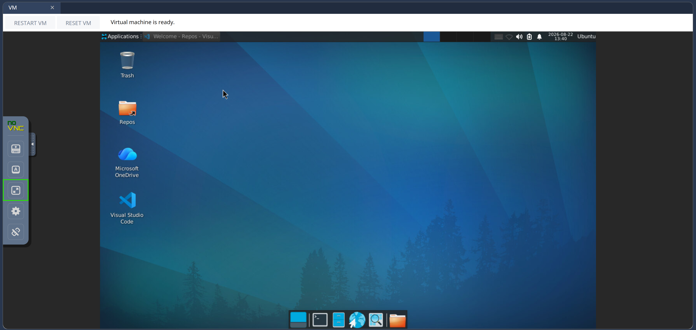
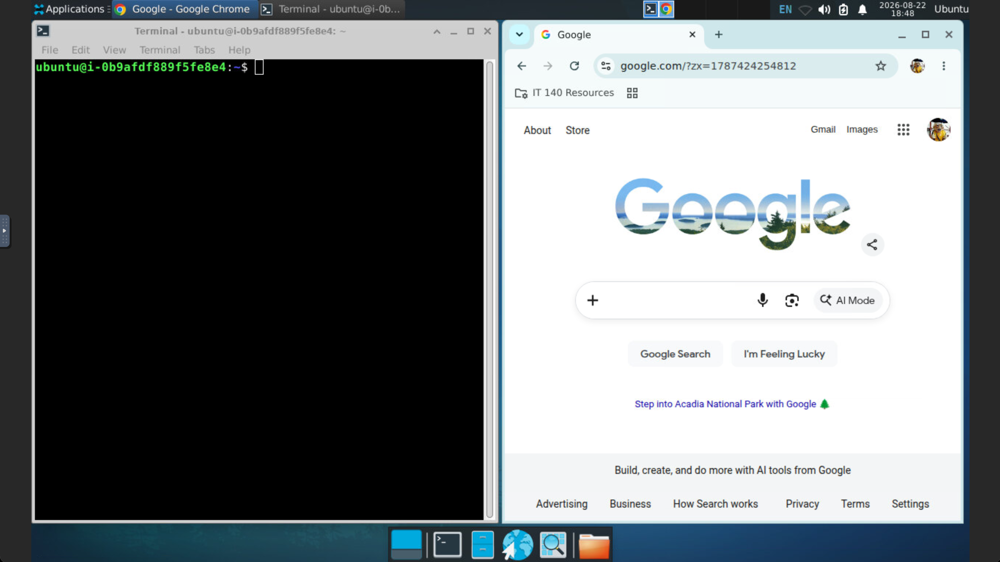
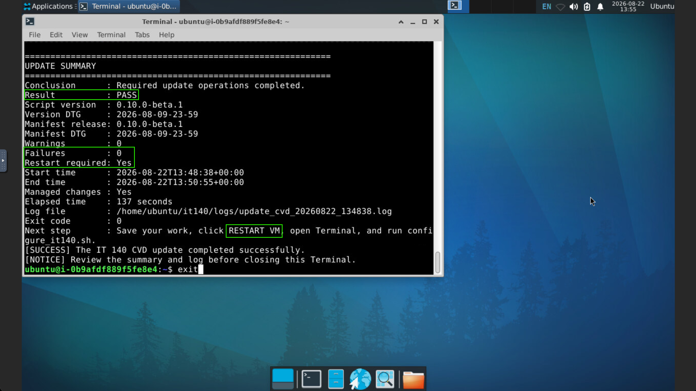
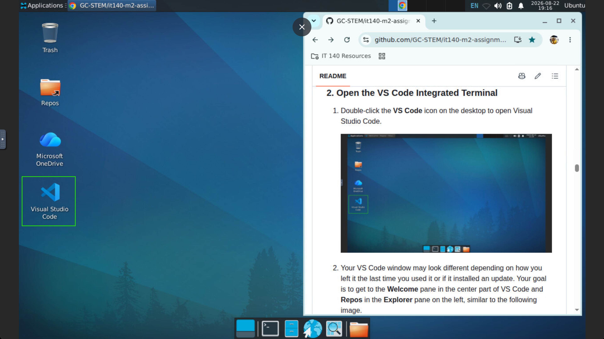
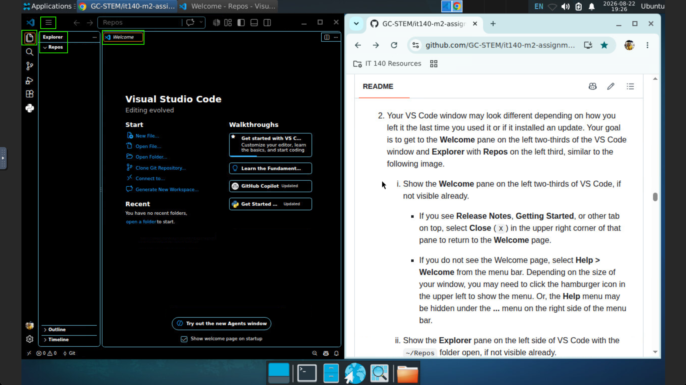
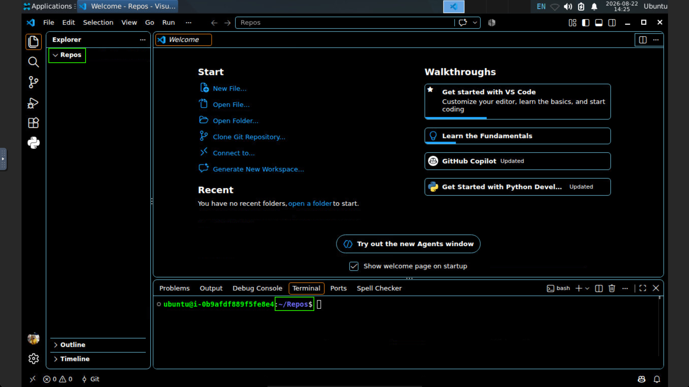
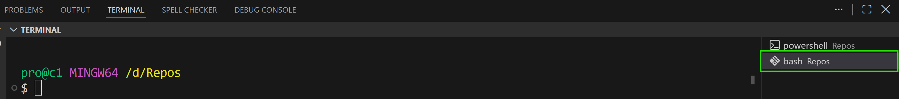
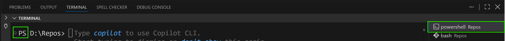
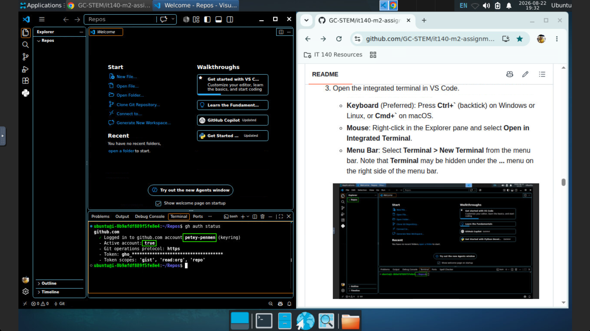

<!-- To see this file in a clean, formatted view, right-click on the filename and choose "Open Preview." -->

# IT 140 Module Two Assignment

- **Course:** IT 140 - *Introduction to Scripting*
- **Activity:** 2-3 Module Two Assignment
- **Activity Type:** Required, graded, with two submissions
  - **Part A:** Name and Age Program (`name_age.py`)
  - **Part B:** IDE Features Reflection (`ide_features.md`)

**Assignment progress:** **0 Start Here** → [1 Part A](./Part-A/README.md) → [2 Part B](./Part-B/README.md) → [3 Submit](#submit-your-assignment)

## Table of Contents

- [IT 140 Module Two Assignment](#it-140-module-two-assignment)
  - [Table of Contents](#table-of-contents)
  - [Start With the Assignment Guidelines and Rubric](#start-with-the-assignment-guidelines-and-rubric)
  - [About This Repository](#about-this-repository)
  - [1. Set Up Your Personal Assignment Repository](#1-set-up-your-personal-assignment-repository)
    - [0. Complete the Module One Setup Tasks](#0-complete-the-module-one-setup-tasks)
    - [1. Launch and Update Your Course IDE](#1-launch-and-update-your-course-ide)
    - [2. Open the VS Code Integrated Terminal](#2-open-the-vs-code-integrated-terminal)
    - [3. Confirm Your GitHub Account](#3-confirm-your-github-account)
    - [3. Create and Clone Your Personal Repository](#3-create-and-clone-your-personal-repository)
    - [4. Open Your Assignment Repository in VS Code](#4-open-your-assignment-repository-in-vs-code)
  - [Complete the Assignment](#complete-the-assignment)
    - [1. Complete Part A](#1-complete-part-a)
    - [2. Complete Part B](#2-complete-part-b)
    - [3. Save Your Work to GitHub](#3-save-your-work-to-github)
    - [4. Review the Automated Repository Checks](#4-review-the-automated-repository-checks)
  - [Return to an Existing Assignment](#return-to-an-existing-assignment)
  - [Reset Your Assignment Repository](#reset-your-assignment-repository)
    - [Restore Your Local Copy From GitHub](#restore-your-local-copy-from-github)
      - [CVD, Linux, macOS, or Git Bash on Windows](#cvd-linux-macos-or-git-bash-on-windows)
      - [Windows PowerShell](#windows-powershell)
    - [Start Over From the Original Course Template](#start-over-from-the-original-course-template)
      - [CVD, Linux, macOS, or Git Bash for Windows](#cvd-linux-macos-or-git-bash-for-windows)
      - [Windows PowerShell Commands](#windows-powershell-commands)
  - [Help and Support](#help-and-support)
  - [Submit Your Assignment](#submit-your-assignment)

## Start With the Assignment Guidelines and Rubric

Before using this repository, open the **Module Two Assignment Guidelines and Rubric** in [D2L Brightspace](https://learn.snhu.edu/). To access it, select **Course Menu** on the NavBar, then **Learning Modules**, and then the **Assignment Information** learning module.

Review the complete assignment guidelines and rubric, including:

- Overview
- Prompt
  - Part A
  - Part B
- What to Submit
- Assignment Rubric

The **Module Two Assignment Guidelines and Rubric** is the official source for assignment requirements, grading criteria, and submission requirements.

This repository provides the starter files, working files, and step-by-step guidance you will use to complete those requirements.

After reviewing the Guidelines and Rubric, return here to set up your personal assignment repository.

## About This Repository

This repository contains the files you will use to complete both parts of the Module Two Assignment.

> [!NOTE]
> The **Codio Virtual Desktop (CVD) is the reference environment for IT 140**. If you completed the [Module One Setup Tasks](https://github.com/GC-STEM/it140-m1-setup-tasks) and use the CVD for this course, Git, GitHub CLI, VS Code, and the expected course repository configuration should already be available. We recommend all students use the CVD for coursework to minimize environment differences and troubleshooting issues.
>
> You may also complete this assignment on a supported local computer configured through the [Module One Setup Tasks | Local](https://github.com/GC-STEM/it140-m1-setup-tasks/tree/main/local). Local environments can vary, so some commands or troubleshooting steps may differ.

In your first coding assignment, you will create your **own personal GitHub repository** from this course repository template and clone your repository to the Codio Virtual Desktop (CVD) and/or your supported local computer.

- Complete your assignment work
- Save changes with Git
- Push your work to GitHub for backup
- Continue working from your own copy of the assignment
- Use automated repository checks when they are available

The main assignment folders are:

```text
it140-m2-assignment/
├── Part-A/
│   ├── README.md
│   ├── name_age_sdw.md
│   ├── analysis/
│   ├── design/
│   ├── src/
│   └── tests/
├── Part-B/
│   ├── README.md
│   └── ide_features.md
└── README.md
```

> [!IMPORTANT]
> **Do not modify files outside `Part-A` or `Part-B`. Within those folders, modify only the working or deliverable files that the instructions specifically tell you to edit.**
>
> For this assignment, your work should be limited to:
>
> - [`Part-A/name_age_sdw.md`](./Part-A/name_age_sdw.md) — Software Development Worksheet working notes
> - [`Part-A/src/name_age.py`](./Part-A/src/name_age.py) — Part A program
> - [`Part-B/ide_features.md`](./Part-B/ide_features.md) — Part B IDE Features Reflection
>
> Leave the READMEs, SRS, SDD, flowchart, pseudocode, tests, and other provided files unchanged.

## 1. Set Up Your Personal Assignment Repository

Complete these steps **only once** before beginning the assignment.

If you already created an `it140-m2-assignment` repository in your GitHub account or already have an `it140-m2-assignment` folder in `~/Repos`, **do not repeat these setup steps**. Open your existing repository instead.

If you need to start over, see [Reset Your Assignment Repository](#reset-your-assignment-repository).

### 0. Complete the Module One Setup Tasks

If you have not completed all the [Module One Setup Tasks](https://github.com/GC-STEM/it140-m1-setup-tasks) on the Codio Virtual Desktop (CVD), do so now. Return here after completing those tasks.

### 1. Launch and Update Your Course IDE

1. Launch the Codio Virtual Desktop (CVD) or your local computer.
   - If you bookmarked the Codio Virtual Desktop (CVD) in your browser, open it now.
   - Otherwise, go to the **Start Here** learning module in [D2L Brightspace](https://learn.snhu.edu/) and click the **Optional Codio Virtual Desktop** web page and then the **Codio Learning Environment**.

   

   > [!TIP] If you have updated your course IDE today, you can skip to [2. Open the VS Code Integrated Terminal](#2-open-the-vs-code-integrated-terminal).

2. If you are on the Codio Virtual Desktop (CVD), expand the window to full screen.

   

3. Organize your desktop so you can view the instructions in this README file and a terminal window at the same time.

   1. Point a web browser to: `https://github.com/GC-STEM/it140-m2-assignment`, if not there already.

   2. Resize the web browser window to take up one side of the screen, as shown. Scroll down to find the place where you left off in this README file.

   3. Open and resize a terminal window on the other side of the screen, as shown.

   

4. If you have not updated your system today, open a terminal window and run the following command for your platform. This will update your course IDE. Be patient while the script runs. It may take a few minutes to complete.

   - Codio Virtual Desktop (CVD) or other Linux terminal:

      ```bash
      update_it140.sh

      ```

   - MacOS:

      ```bash
      update_it140.zsh

      ```

   - Windows PowerShell:

      ```powershell
      update_it140.ps1

      ```

   

5. Review the output to confirm that the update completed successfully.
   - Result: PASS
   - Failures: 0
   - Restart required: Yes or No
   - Exit code: 0
   - If you see any errors, do not continue. Use the [Help and Support](#help-and-support) resources to resolve the issue before continuing.

6. Type `exit` to close the terminal window when the update is complete. Restart your environment if required.
   - On the CVD, click **RESTART VM**. Do NOT click **RESET VM**.

### 2. Open the VS Code Integrated Terminal

1. Double-click the **VS Code** icon on the desktop to open Visual Studio Code.

   

2. Your VS Code window may look different depending on how you left it the last time you used it or if it installed an update. Your goal is to get to the **Welcome** pane in the center part of VS Code and **Repos** in the **Explorer** pane on the left, similar to the following image.

   1. Show the **Welcome** page in the center of VS Code, if not visible already.

      - If you see **Release Notes** or **Getting Started**, select **Close** (`X`) in the upper right corner of that pane to return to the **Welcome** page.

      - If you do not see the Welcome page, select **Help > Welcome** from the menu bar. **Help** may be hidden under the **...** menu on the right side of the menu bar.

   2. Show the **Explorer** pane on the left side of VS Code with the `~/Repos` folder open, if not visible already.

     - If you do not see the Explorer pane, select **View > Explorer** from the menu bar or select the **Explorer** icon in the Activity Bar on the left side of VS Code.

     - If you do not see **Repos** in the Explorer pane, select **Open Folder** and open your `~/Repos` folder. Remember that `~` is a shortcut to, or an abbreviation for, your home folder.

   

3. Open the integrated terminal in VS Code.
   - **Keyboard** (Preferred): Press **Ctrl+\`** (backtick) on Windows or Linux, or **Cmd+\`** on macOS.
   - **Mouse**: Right-click in the Explorer pane and select **Open in Integrated Terminal**.
   - **Menu Bar**: Select **Terminal > New Terminal** from the menu bar. Note that **Terminal** may be hidden under the **...** menu on the right side of the menu bar.

   

   > [!NOTE] Notice how the integrated terminal opens to the current folder shown in the **Explorer** pane. If your terminal did not open to `~/Repos`, do not worry. We will change to the correct folder in the next step.

> [!IMPORTANT]
> Windows users must use a **Git Bash** or a **PowerShell** terminal in VS Code to run the commands in this repository. A Command (cmd.exe) terminal will not work.
>
> 
> 

### 3. Confirm Your GitHub Account

1. Type or copy and paste the following command in the VS Code integrated terminal. Press **Enter** to run the command if it did not run automatically. This command checks which GitHub account is currently active in your GitHub CLI.:

   ```bash
   gh auth status

   ```

   

2. Review the "Logged in to github.com account:" and "Active account:" lines in the output.

   - If your GitHub username is listed but active account is **false**, continue to Step 2.3.
   - If your GitHub username is not listed, continue to Step 2.4.
   - If the correct GitHub username is active and active account is **true**, continue to Step 2.6.

3. If your IT 140 GitHub account is listed but is not active, type the following command, replacing `your-github-username` with your GitHub username:

   `gh auth switch --user your-github-username`

   Then return to Step 2.1 to confirm that the correct account is now active.

4. If your IT 140 GitHub account is not listed, type:

   `gh auth login --web`

   Follow the GitHub CLI prompts and sign in with the GitHub account you use on this platform.

5. When sign-in is complete, return to Step 2.1 and check your account again.

6. Continue to Step 3.0 - Create and Clone Your Personal Repository.

### 3. Create and Clone Your Personal Repository

The following command block will:

1. Go to your course `~/Repos` folder.
2. Configure Git to use your GitHub CLI authentication.
3. Bookmark the original IT 140 assignment repository so it is easier to find again.
4. Create your personal assignment repository in GitHub.
5. Clone your new repository to your CVD or local computer.
6. Enter the cloned repository folder.
7. Show the GitHub repository connected to your local copy.

Copy the entire command block and paste it into the VS Code integrated terminal.

```bash
cd ~/Repos
gh auth setup-git
gh api --method PUT /user/starred/GC-STEM/it140-m2-assignment
gh repo create it140-m2-assignment --template GC-STEM/it140-m2-assignment --private --clone
cd it140-m2-assignment
git remote -v

```

Review the final output and confirm that the repository belongs to **your GitHub account**.

If a command reports an error, do not repeat the entire command block. Review the error message and use the [Help and Support](#help-and-support) resources before continuing.

### 4. Open Your Assignment Repository in VS Code

Now open the repository you just cloned.

In VS Code:

1. Select **File > Open Folder**.
2. Open `~/Repos/it140-m2-assignment`.
3. Confirm that `it140-m2-assignment` is the top-level folder shown in the Explorer.

You are now working in your personal copy of the Module Two Assignment.

## Complete the Assignment

### 1. Complete Part A

Open:

**[Part A | Name and Age Program](./Part-A/README.md)**

Part A guides you through a simplified software development life cycle:

> **Analyze → Design → Construct → Test**

Start with the Software Development Worksheet (SDW) as directed in the Part A README.

As you work, pay attention to VS Code features that help you review documents, understand code, write your program, identify problems, run your program, or test your work. Make brief notes about useful features so you can use your own observations in Part B.

### 2. Complete Part B

After completing and testing Part A, open:

**[Part B | IDE Features Reflection](./Part-B/README.md)**

Follow the step-by-step instructions to complete `ide_features.md` using observations from your Part A work.

### 3. Save Your Work to GitHub

Save your files normally while you work in VS Code.

Periodically commit and push your assignment work so your personal GitHub repository contains a current backup. You can do this using the Source Control tools in the VS Code user interface, or from the command line as described below.

From the repository root in the VS Code integrated terminal, run:

```bash
cd ~/Repos/it140-m2-assignment
git status
git add Part-A/name_age_sdw.md Part-A/src/name_age.py Part-B/ide_features.md
git commit -m "Save Module Two assignment progress"
git push
```

These commands:

- Show which files have changed.
- Stage only the student working and deliverable files for this assignment.
- Create a Git commit containing those changes.
- Push the commit to your personal GitHub repository.

If Git reports that there is nothing to commit, your local files do not contain any new changes that need to be saved to GitHub.

> [!NOTE]
> GitHub is used to develop and back up your work. **Assignment submission, grading, and instructor feedback remain in D2L Brightspace.**

### 4. Review the Automated Repository Checks

Each time you push changes to GitHub, the **Assignment Checks** workflow runs automatically in your personal repository.

While you are still working, a red **X** can simply mean that one or more assignment files are not finished yet. As you complete and push your work, the checks will verify that:

- The provided repository files are still present and unchanged.
- The required non-code assignment artifacts are present and readable.
- `Part-A/src/name_age.py` contains valid Python and passes the course Ruff checks.
- The Part A starter TODO prompts have been replaced.
- The Part B reflection no longer contains its starter placeholder text.
- The completed Part A program passes the five provided acceptance tests.

To review a check:

1. Open your `it140-m2-assignment` repository on GitHub.
2. Select **Actions**.
3. Open the most recent **Assignment Checks** run.
4. Open **Check assignment repository** to see which check passed or needs attention.

> [!NOTE]
> A green check means your repository passed these automated checks. It does **not** assign a grade, guarantee a particular grade, replace Sense feedback, or submit your assignment. Follow the official Module Two Assignment Guidelines and Rubric in D2L Brightspace for submission and grading requirements.

## Return to an Existing Assignment

You only create your personal assignment repository once.

When you return to the assignment later:

1. Open VS Code.
2. Select **File > Open Folder**.
3. Open `~/Repos/it140-m2-assignment`.
4. Continue working where you stopped.

You do not need to create the repository from the template again.

If you are working on another computer that does not yet have your assignment repository, clone your existing personal repository instead of creating another repository from the template.

From `~/Repos`, use:

```bash
cd ~/Repos
gh repo clone "$(gh api user --jq .login)/it140-m2-assignment"
cd it140-m2-assignment
git status
```

Then open the cloned `it140-m2-assignment` folder in VS Code.

## Reset Your Assignment Repository

If something goes wrong, choose the recovery option that matches the problem.

### Restore Your Local Copy From GitHub

Use this option when your files on the current computer are damaged or confusing, but the copy you previously pushed to GitHub is good.

This process preserves your current local folder as a backup and then clones a fresh local copy of your personal repository.

#### CVD, Linux, macOS, or Git Bash on Windows

```bash
cd ~/Repos
mv it140-m2-assignment "it140-m2-assignment-local-backup-$(date +%Y%m%d-%H%M%S)"
gh repo clone "$(gh api user --jq .login)/it140-m2-assignment"
cd it140-m2-assignment
git status
```

#### Windows PowerShell

```powershell
cd ~/Repos
Rename-Item it140-m2-assignment "it140-m2-assignment-local-backup-$(Get-Date -Format 'yyyyMMdd-HHmmss')"
gh repo clone "$(gh api user --jq .login)/it140-m2-assignment"
cd it140-m2-assignment
git status
```

Your previous local folder remains in `~/Repos` with `local-backup` and a date and time added to its name.

Open the newly cloned `it140-m2-assignment` folder in VS Code and continue working.

### Start Over From the Original Course Template

Use this option only when you want to **restart the entire assignment from the original course template**.

This process preserves your current work by:

1. Renaming your existing local assignment folder.
2. Renaming your existing personal GitHub repository.
3. Creating a new `it140-m2-assignment` repository from the original course template.
4. Cloning the new repository to your computer.

#### CVD, Linux, macOS, or Git Bash for Windows

```bash
cd ~/Repos
backup="it140-m2-assignment-backup-$(date +%Y%m%d-%H%M%S)"
mv it140-m2-assignment "$backup"
gh repo rename "$backup" --repo "$(gh api user --jq .login)/it140-m2-assignment" --yes
gh repo create it140-m2-assignment --template GC-STEM/it140-m2-assignment --private --clone
cd it140-m2-assignment
git remote -v
```

#### Windows PowerShell Commands

```powershell
cd ~/Repos
$backup = "it140-m2-assignment-backup-$(Get-Date -Format 'yyyyMMdd-HHmmss')"
Rename-Item it140-m2-assignment $backup
gh repo rename $backup --repo "$(gh api user --jq .login)/it140-m2-assignment" --yes
gh repo create it140-m2-assignment --template GC-STEM/it140-m2-assignment --private --clone
cd it140-m2-assignment
git remote -v
```

Your previous local folder and GitHub repository are preserved using the generated backup name.

Open the new `~/Repos/it140-m2-assignment` folder in VS Code and begin again with [Part A](./Part-A/README.md).

> [!IMPORTANT]
> Starting over creates a new copy of the original assignment files. Work that exists only in your previous repository is **not automatically copied into the new assignment repository**.

## Help and Support

The README files contain the instructions you need to complete each part of the assignment.

The repository Wiki provides supplemental information about topics such as:

- Using the Module Two Assignment repository
- The simplified software development life cycle
- Working with Markdown files
- Using VS Code features
- Git and GitHub workflows
- Testing and troubleshooting

<!-- FUTURE: Replace with direct Wiki page links when the Module Two Assignment Wiki is published. -->

Use [GitHub Issues](https://github.com/GC-STEM/it140-m2-assignment/issues) to report a technical problem with the **provided course repository, starter files, or course tools**.

Use [GitHub Discussions](https://github.com/GC-STEM/it140-m2-assignment/discussions) for repository-related questions and discussions when appropriate.

For questions about assignment requirements, grading, deadlines, accommodations, or instructor feedback, contact your instructor through **D2L Brightspace**.

## Submit Your Assignment

After completing Part A and Part B, return to the **Module Two Assignment Guidelines and Rubric** in [D2L Brightspace](https://learn.snhu.edu/).

Read the Guidelines and Rubric again before submitting your work.

Confirm that:

- You completed all required Part A work.
- You completed all required Part B work.
- Your work meets the grading rubric criteria.
- You are submitting the correct files and file formats.
- Your final files are saved.
- Your latest work is backed up in your personal GitHub repository.

Follow the **What to Submit** instructions in the Module Two Assignment Guidelines and Rubric to submit your assignment in D2L Brightspace.

Do not submit working files, provided design documents, test files, README files, or your GitHub repository unless the Module Two Assignment Guidelines and Rubric specifically instruct you to do so.

**GitHub does not submit your assignment for grading.**

<!-- Artifact Metadata

- Course: IT 140 - Introduction to Scripting
- Artifact Title: 2-3 Module Two Assignment | Start Here
- Artifact Type: Required assignment guidance and repository workflow
- Artifact Purpose: Guide students from the official D2L assignment requirements through personal GitHub repository setup, Parts A and B, backup, recovery, and final D2L submission.
- Artifact Description: Students review the official Guidelines and Rubric, create a personal repository from the course template, complete Parts A and B in VS Code, save work to GitHub, and return to D2L Brightspace to submit the required assignment files.
- Artifact Version: {{semantic version number}}
- Artifact Date: {{artifact date in YYYY-MM-DD format}}
- Development Status: {{development status}}

-->
