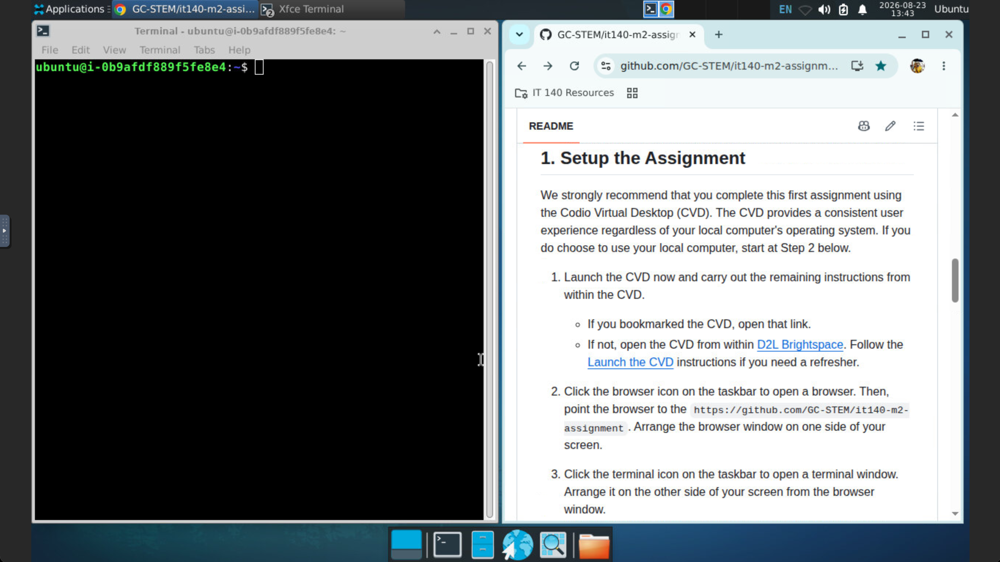
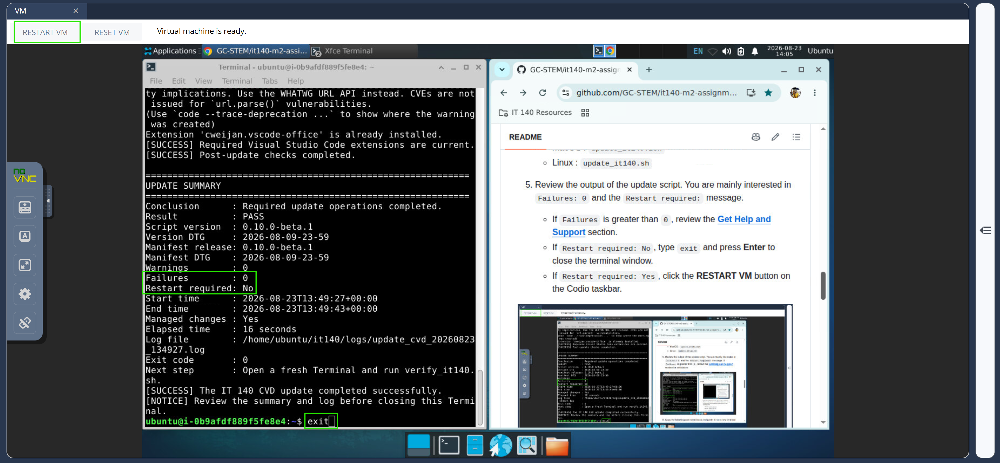

<!-- To see this file in a clean, formatted view, right-click on the filename and choose "Open Preview." -->

# IT 140 Module Two Assignment | Start Here

- **Course:** IT 140 - *Introduction to Scripting*
- **Activity:** 2-3 Module Two Assignment
- **Activity Type:** Required, graded, with two submissions
  - **Part A:** Name and Age Program (`name_age.py`)
  - **Part B:** IDE Features Reflection (`ide_features.md`)

**Assignment progress:** **0 Start Here** → [1 Part A](./Part-A/README.md) → [2 Part B](./Part-B/README.md) → [3 Submit](#submit-your-assignment)

## Table of Contents

- [IT 140 Module Two Assignment | Start Here](#it-140-module-two-assignment--start-here)
  - [Table of Contents](#table-of-contents)
  - [0. Meet the Prerequisites](#0-meet-the-prerequisites)
  - [1. Setup the Assignment](#1-setup-the-assignment)
  - [2. Complete Part A](#2-complete-part-a)
  - [3. Complete Part B](#3-complete-part-b)
  - [4. Submit Your Assignment](#4-submit-your-assignment)
  - [5. Get Help and Support](#5-get-help-and-support)

## 0. Meet the Prerequisites

- [ ] **Required**. To start this assignment, you must have completed the [GitHub](https://github.com/GC-STEM/it140-m1-setup-tasks/tree/main/github) and [Codio](https://github.com/GC-STEM/it140-m1-setup-tasks/tree/main/codio) sections of the [Module One Setup Tasks](https://github.com/GC-STEM/it140-m1-setup-tasks). If you have not done so, please complete those tasks now. Return here after completing those tasks.

- [ ] **Recommended**. Complete all Module One and Two zyBooks activities (Participation and Lab) in [D2L Brightspace](https://learn.snhu.edu/). These activities introduce you to the skills you will use in this assignment.

## 1. Setup the Assignment

We strongly recommend that you complete this first assignment using the Codio Virtual Desktop (CVD). The CVD provides a consistent user experience regardless of your local computer's operating system. If you do choose to use your local computer, start at Step 2 below.

1. Launch the CVD now and carry out the remaining instructions from within the CVD.
   - If you bookmarked the CVD, open that link.
   - If not, open the CVD from within [D2L Brightspace](https://learn.snhu.edu/). Follow the [Launch the CVD](https://github.com/GC-STEM/it140-m1-setup-tasks/blob/main/codio/README.md#1-launch-the-cvd) instructions if you need a refresher.

2. Click the browser icon on the taskbar to open a browser. Then, point the browser to the `https://github.com/GC-STEM/it140-m2-assignment`. Arrange the browser window on one side of your screen.

3. Click the terminal icon on the taskbar to open a terminal window. Arrange it on the other side of your screen from the browser window.

   

4. In the CVD terminal window, type `update_it140.sh` and press **Enter**. This will update the course IDE to the latest version. Be patient. It may take a few minutes to complete. If using a local computer, use the appropriate script extension for your operating system:
   - Windows: `update_it140.ps1`
   - macOS  : `update_it140.zsh`
   - Linux  : `update_it140.sh`

5. Review the output of the update script. You are mainly interested in `Failures: 0` and the `Restart required:` message.
   - If `Failures` is greater than `0`, review the [**Get Help and Support**](#5-get-help-and-support) section.
   - If `Restart required: No`, type `exit` and press **Enter** to close the terminal window.
   - If `Restart required: Yes`, click the **RESTART VM** button on the Codio taskbar and wait for the CVD to restart.

   

6. Open a new terminal window and copy the following command block and paste it into the new terminal window. Press **Enter** to run.

    ```bash
    cd ~/Repos 
    gh auth setup-git 
    gh api --method PUT /user/starred/GC-STEM/it140-m2-assignment 
    gh repo create it140-m2-assignment --template GC-STEM/it140-m2-assignment --private --clone 
    cd it140-m2-assignment
    git remote -v
    ```

7. Review the output of the last command. You should see two lines that look like this:

## 2. Complete Part A

1. In a terminal window, copy and paste the following command to open the assignment repository in VS Code. Press **Enter** to run.

    ```bash
    code ~/Repos/it140-m2-assignment
    ```

2. In the **Explorer** pane of VS Code
   1. Click **> it140-m2-assignment** to expand the folder.
   2. Click **> Part-A** to expand the folder.

3. Right-click on the `Part-A/README.md` file and select **Open to the Side**.

4. You will now follow instructions in the `Part-A/README.md` file. When ready, maximize the VS Code window.

## 3. Complete Part B

1. In a terminal window, copy and paste the following command to open the assignment repository in VS Code. Press **Enter** to run.

    ```bash
    code ~/Repos/it140-m2-assignment
    ```

2. In the **Explorer** pane of VS Code
   1. Click **> it140-m2-assignment** to expand the folder.
   2. Click **> Part-B** to expand the folder.

3. Right-click on the `Part-B/README.md` file and select **Open to the Side**.

4. You will now follow instructions in the `Part-B/README.md` file. When ready, maximize the VS Code window if not already maximized.

## 4. Submit Your Assignment

In your IT 140 course in [D2L Brightspace](https://learn.snhu.edu/), go to the **Course Menu** and select **Assignments**. Click on the **2-3 Assignment: Software Development Introduction** link. Follow the instructions to submit your assignment. You will submit the following files as one submission:

- Graded files:
  - [`name_page.py`](./Part-A/src/name_page.py)
  - [`ide_features.md`](./Part-B/ide_features.md)

- Ungraded files:
  - [`name_age_sdw.md`](./Part-A/name_age_sdw.md)

## 5. Get Help and Support
