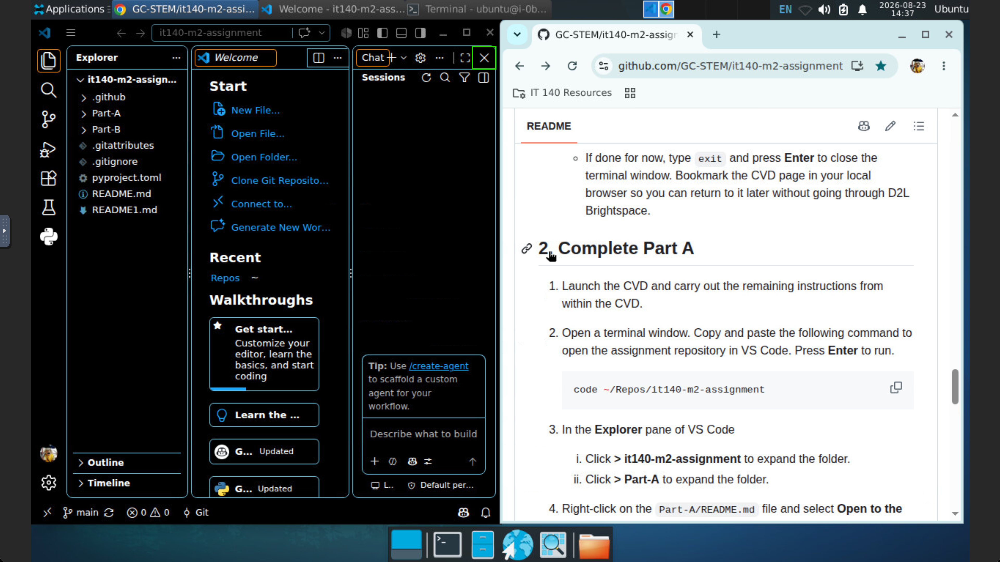
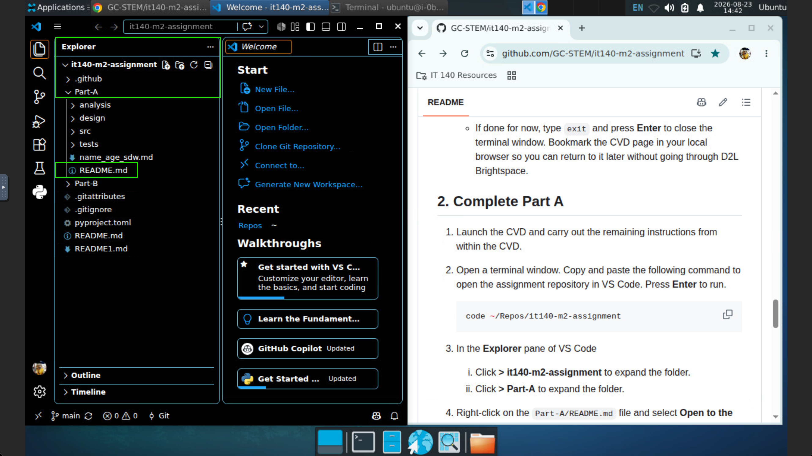
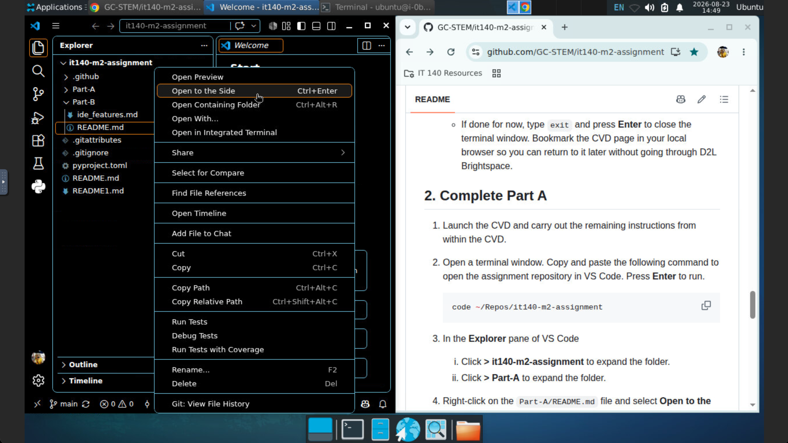

<!-- To see this file in a clean, formatted view, select "Text Editor ▼" in the upper-right corner of the editor, then select "Markdown Preview". -->

# IT 140 Module Two Assignment | Software Development Introduction

---

> [!IMPORTANT]
> **GitHub repository options**
>
> **Do not select Fork or Use this template.** These options will interfere with the repository setup commands later in this README.
>
> - 🚫 **Fork — Do not use**
> - 🚫 **Use this template — Do not use**
> - ⭐ **Star** — The setup commands later in this README will bookmark this repository so you can find it more easily.
> - 👁️ **Watch**
>   - **Students:** Not recommended. Watching is not needed and may generate unnecessary notifications.
>   - **Faculty:** Consider selecting **Watch → Custom → Releases + Issues** to receive major repository updates and follow reported issues.

---

> [!NOTE]
> **🆕 New for 2026 C-5:** IT 140 now uses GitHub repositories to provide assignment starter files, development resources, and supporting documentation.
>
> If you find a problem with this GitHub repository or its instructions, or have a suggestion for improvement, please open [GitHub Issues](https://github.com/GC-STEM/it140-m2-assignment/issues) to review existing issues or create a new issue.

---

- **Course**: IT 140 - *Introduction to Scripting*
- **Task Title**: 2-3: Software Development Introduction
- **Task Type**: Required, graded, one submission required
- **Repository Version**: 1.0.0
- **Repository Version Date**: 08/29/2026

## Table of Contents

Complete the following tasks in order to complete the Module Two assignment. Each task is described in detail below.

- [IT 140 Module Two Assignment | Software Development Introduction](#it-140-module-two-assignment--software-development-introduction)
  - [Table of Contents](#table-of-contents)
  - [0. Meet the Prerequisites](#0-meet-the-prerequisites)
  - [1. Setup the Assignment](#1-setup-the-assignment)
  - [2. Complete Part A](#2-complete-part-a)
  - [3. Complete Part B](#3-complete-part-b)
  - [4. Submit Your Assignment](#4-submit-your-assignment)
  - [Get Help and Support](#get-help-and-support)

## 0. Meet the Prerequisites

- [ ] **Required**. To start this assignment, you must have completed the [GitHub](https://github.com/GC-STEM/it140-m1-setup-tasks/tree/main/github) and [Codio](https://github.com/GC-STEM/it140-m1-setup-tasks/tree/main/codio) sections of the [Module One Setup Tasks](https://github.com/GC-STEM/it140-m1-setup-tasks). If you have not done so, please complete those tasks now. Return here after completing those tasks.

- [ ] **Recommended**. Complete all Module One and Two zyBooks activities (Participation and Lab) in [D2L Brightspace](https://learn.snhu.edu/). These activities introduce you to the skills you will use in this assignment.

## 1. Setup the Assignment

We strongly recommend that you complete this first assignment using the Codio Virtual Desktop (CVD). The CVD provides a consistent user experience regardless of your local computer's operating system. If you do choose to use your local computer, start at Step 2 below.

1. Launch the CVD now and carry out the remaining instructions from within the CVD.
   - If you bookmarked the CVD, open that link.
   - If not, open the CVD from within [D2L Brightspace](https://learn.snhu.edu/). Follow the [Launch the CVD](https://github.com/GC-STEM/it140-m1-setup-tasks/blob/main/codio/README.md#1-launch-the-cvd) instructions if you need a refresher.

2. Click the browser icon on the taskbar to open a browser. Then, point the browser to `https://github.com/GC-STEM/it140-m2-assignment`. Arrange the browser window on one side of your screen, as shown below.

3. Click the terminal icon on the taskbar to open a terminal window. Arrange it on the other side of your screen from the browser window, as shown below.

   

4. In the CVD terminal window, type `update_it140.sh` and press **Enter**. This will update the course IDE to the latest version. Be patient. It may take a few minutes to complete. If using a local computer, use the appropriate script extension for your operating system:
   - Windows: `update_it140.ps1`
   - macOS  : `update_it140.zsh`
   - Linux  : `update_it140.sh`

5. Review the output of the update script. You are mainly interested in `Failures: 0` and the `Restart required:` message.
   - If `Failures` is greater than `0`, review the [**Get Help and Support**](#get-help-and-support) section.
   - If `Restart required: No`, type `exit` and press **Enter** to close the terminal window.
   - If `Restart required: Yes`, click the **RESTART VM** button on the Codio taskbar and wait for the CVD to restart.

   

6. Open a new terminal window and copy the following command block and paste it into the new terminal window. If prompted about a "Potentially Unsafe Paste", click the **Paste** button. Press **Enter** to run the commands.

    ```bash
    cd ~/Repos
    gh auth setup-git
    gh api --method PUT /user/starred/GC-STEM/it140-m2-assignment
    gh repo create it140-m2-assignment --template GC-STEM/it140-m2-assignment --private --clone
    cd it140-m2-assignment
    git remote -v
    ```

    *Note*. The above commands only work the first time you run them successfully. If you want to update your repository later or start over, see the [**Get Help and Support**](#get-help-and-support) section.

7. Review the output of the last command. You should see output similar to the what is shown below, except with your GitHub username in place of `petey-penmen`.

   

8. Determine if you want to continue to Part A now or if you want to stop and continue later.
   - If you want to continue to Part A now, type `code .` and press **Enter**. Skip to Step 3 in **2. Complete Part A**.
   - If done for now, type `exit` and press **Enter** to close the terminal window. Bookmark the CVD page in your local browser, if you have not already, so you can return to it later without going through D2L Brightspace.

## 2. Complete Part A

1. Launch the CVD and carry out the remaining instructions from within the CVD.

2. Open a terminal window. Copy and paste the following command to open the assignment repository in VS Code. Press **Enter** to run.

    ```bash
    code ~/Repos/it140-m2-assignment
    ```

3. If the **Chat** pane opens in VS Code, click the **X** in the upper right corner for that pane to close it. Do NOT click the **X** to close the entire VS Code window right above it.

   

4. In the **Explorer** pane of VS Code"
   - Click **> it140-m2-assignment** to expand the folder, if needed.
   - Click **> Part-A** to expand the folder, if needed.

   

5. Right-click on the `Part-A/README.md` file and select **Open to the Side**.

   

6. You will now follow instructions in the `Part-A/README.md` file. When ready, maximize the VS Code window by clicking the **Maximize** button in the upper right corner of the VS Code window. Look for the green box in the previous screenshot.

## 3. Complete Part B

1. If not already running, launch the CVD and carry out the remaining instructions from within the CVD.

2. Open a terminal window. Copy and paste the following command to open the assignment repository in VS Code. Press **Enter** to run.

    ```bash
    code ~/Repos/it140-m2-assignment
    ```

3. If the **Chat** pane opens in VS Code, click the **X** in the upper right corner for that pane to close it. Do NOT click the **X** to close the entire VS Code window.

   

4. In the **Explorer** pane of VS Code"
   - Click **> it140-m2-assignment** to expand the folder, if needed.
   - Click **> Part-B** to expand the folder, if needed.

   

5. Right-click on the `Part-B/README.md` file and select **Open to the Side**.

   

6. You will now follow instructions in the `Part-B/README.md` file. When ready, maximize the VS Code window by clicking the **Maximize** button in the upper right corner of the VS Code window right above it. Look for the green box in the previous screenshot.

## 4. Submit Your Assignment

In your IT 140 course in [D2L Brightspace](https://learn.snhu.edu/), go to the **Course Menu** and select **Assignments**. Click on the **2-3 Assignment: Software Development Introduction** link. Follow the instructions to submit your assignment. Submit the following files in Brightspace as one submission:

- Graded files:
  - [`name_age.py`](./Part-A/src/name_age.py)
  - [`ide_features.md`](./Part-B/ide_features.md)

- Ungraded files:
  - [`name_age_sdw.md`](./Part-A/name_age_sdw.md)

## Get Help and Support

<!--
**🚨 DANGER**. Run these commands only when you are setting up the Module Two assignment repository for the first time or when you intentionally want to start over from a fresh copy. These commands will **delete and replace** any existing `it140-m2-assignment` repository in both your GitHub account and your local `~/Repos` folder. Any work or changes saved only in those copies will be **permanently lost**. If you have already started the assignment and want to keep your work, do NOT run these commands.

```bash
cd ~/Repos
gh auth setup-git
gh api --method PUT /user/starred/GC-STEM/it140-m2-assignment
username="$(gh api user --jq .login)"
rm -rf it140-m2-assignment
gh repo delete "$username/it140-m2-assignment" --yes 2>/dev/null || true
gh repo create it140-m2-assignment --template GC-STEM/it140-m2-assignment --private --clone
cd it140-m2-assignment
git remote -v
```
-->
